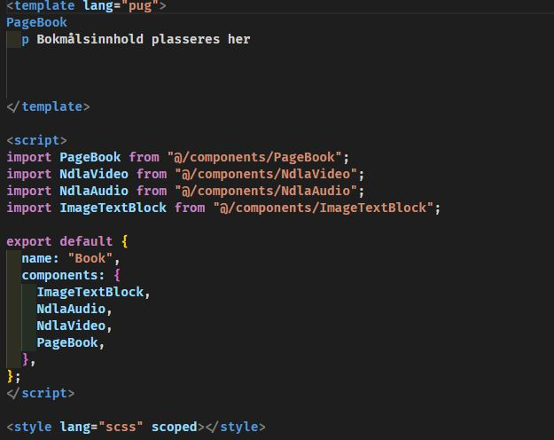
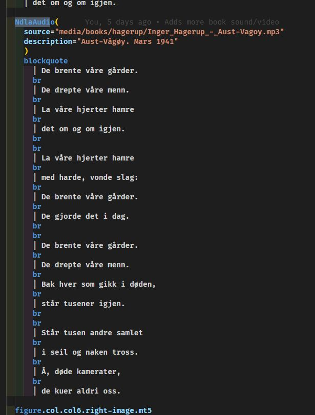
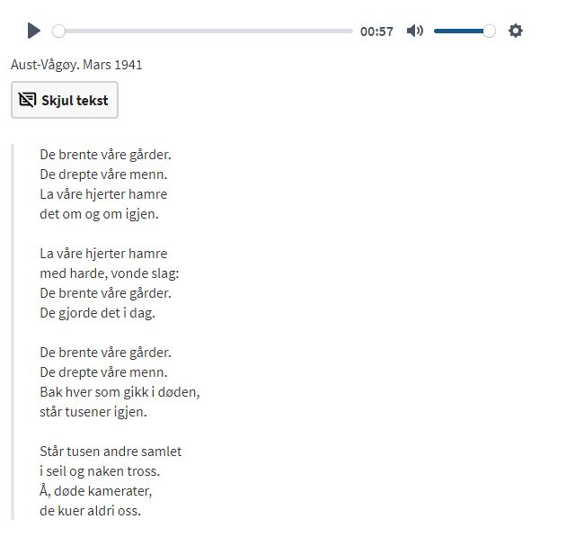
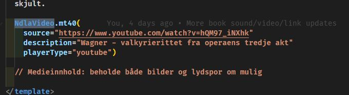
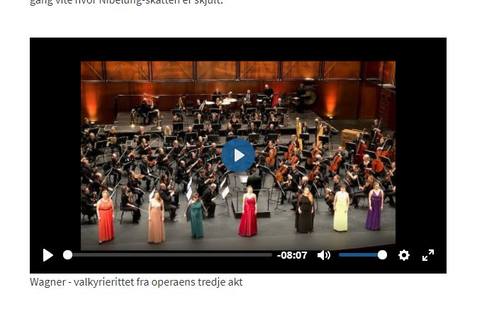
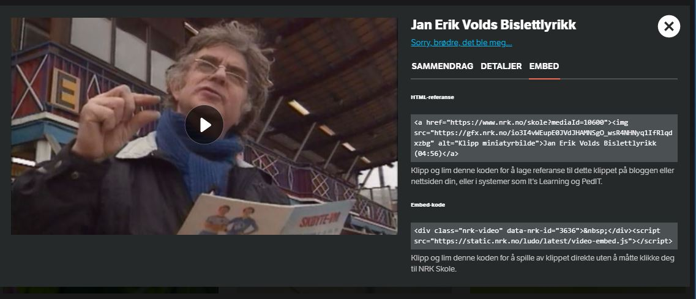
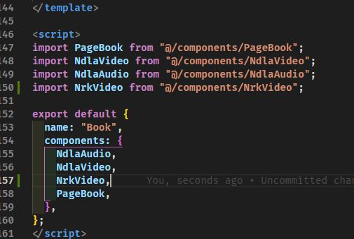
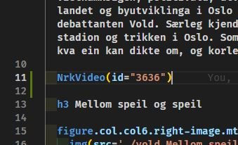

# Komponenter

For å forenkle innlegging av data har vi laget noen egne komponenter.

## PagePeriod og PageBook

Dette er hovedkomponentene for henholdsvis perioder og bøker. Alle artikkelsider for perioder og bøker bør bruke disse.

I `src/books/_templastes` ligger det to tomme filer, en for bokmål, en for nynorsk, som kan brukes som utgangspunkt for både nye bøker og nye perioder.

Her ligger `PageBook` som eneste komponent i roten. Skal man lage en ny periode erstattes denne med `PagePeriod`. **NB! Husk å oppdatere import og components i `<script>`-delen av koden også.**

Alt innholdet legges en `tab` inn (og erstatter `p Bokmålsinnhold plasseres her`).

## NdlaAudio

Komponenten brukes for å spille av lydfiler. Basert på [Plyr](https://plyr.io/) open source media player.

Den har to parametre:

`source` - Url til lydfilen. Kan være både en lokal eller ekstern URL. For lokale URLer er roten `/public`.

`description` - En tekst som vises under lydfilen.

Komponenten har også en slot som kan brukes til å legge inn mer tekst. Hvis det legges noe i slotten vil playeren få en knapp "Vis tekst". Ved å trykke på denne kan brukeren få opp innholdet i slotten.

**Eksempel på bruk**

## NdlaVideo

Komponent for å spille av video. Basert på [Plyr](https://plyr.io/) open source media player. Kan spille av lokale og eksterne filer, i tillegg til YouTube.

Har følgende parametre:

`source` - URL til videofilen. Kan både være lokal URL, ekstern URL eller URL til YouTube. For lokale URLer er roten `/public`.

`captionsUrl` - URL til `.vtt` fil med teksting. Ikke nødvendig.

`description` - Tekstbeskrivelse som vises under videovinduet?

`poster` - URL til bildefil som kan vises før videoen er lastet. Ikke testet.

`playerType` - Brukes hvis man vil vise YouTube-videoer. Dette er en streng som må være enten `local` eller `youtube`. Default er `local`, så det er kun nødvendig å definere den hvis man skal spille av YouTube.

**Eksempel på bruk**

## NrkVideo

Dette er en komponent for å integrere videoer fra [NRK Skole](https://www.nrk.no/skole). Det er i utgangspunktet embed-koden som er hentet fra NRK sine sider, men gjort om til en Vue-komponent.

1. Når man har søkt opp og funnet videoklippet man vil bruke må man gå inn på **EMBED** fanen og finne koden som står i feltet `data-nrk-id`. I bildet under er dette `3636`.

2. Sørg for at komponenten `NrkVideo` er importert og lagt til listen av komponenter.

3. Legg inn komponenten på ønsket sted på siden. Koden fra steg 1 legges inn i parameter `id`.

