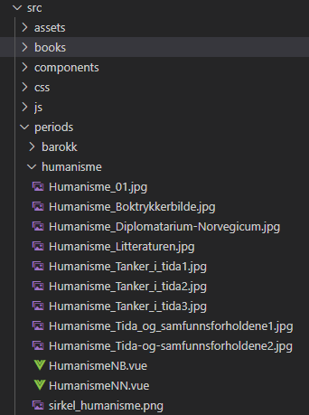

# Filer og filstruktur

Filstrukturen er lagt opp slik at hver bok og periode har sin egen folder, helholdsvis under `/src/books` og `/src/periods`. Folderne for bøkene har navn etter forfatter (noe som henger igjen etter Flash-versjonen), mens periodene har navn etter periodene. I de tilfellene hvor en boks forfatter(e) er ukjent brukes boknavn.

I hver folder ligger:

- To `.vue`-filer, en for hvert språk, som inneholder tekst m tilhørende HTML/Pug, Javascript og evt. CSS for siden.
- Alle bildefilene som hører til de to artiklene.

I periode-folderen ligger også sirkelgrafikkens om brukes i tidslinjen, samt bannergrafikken som ligger i toppen av hver periode.

Eksempel:

## Lyd- og videofiler

Lyd- og videofiler som er **under 100Mb** og tilhørende tekstingsfiler ligger i foldere under `/public/media`. Disse følger samme navngivings-struktur som folderne over, dvs `/books/<forfatternavn>` og `/periods/<periodenavn>`.

### Filer over 100Mb

Github er i utgangspunktet ikke laget for store binærfiler som video og lyd. På grunn av dette støttes ikke opplasting av filer over 100Mb.

Filer over 100Mb må defor kopieres **manuelt** til webserveren hvor filene skal ligge og legges i `/public/media/videos`. Her er det ikke egne foldere for bøker og perioder, men ellers følges samme navngivingsstruktur som over. Eksempel: `/public/media/videos/wergeland/Henrik_Wergeland.mp4`.

For enkelhets skyld legges også tekstingsfiler som hører til videofilene her.

## Andre foldere

- `assets` - Grafiske elementer som ikke er knyttet til spesielle artikler
- `components` - Vue-komponenter som er brukt på de forskjellige sidene. Se [egen side](./components.md) for mer info.
- `js/authorsData.js` - Array av objekter som inneholder data og tekst om de forskjellige forfatterne
- `js/booksData.js` - Array med id, navn, forfatter, årstall, plassering fra toppen (i piksler) og periode. Sistnevnte ser ikke ut itl å være i bruk.
- `js/periodsData.js` - Array med id, navn, fra- og til årstall, bredde-muliplier og en array med årstall og antall piskler pr. periode.
- `js/` - Andre js-filer som ligger her er filer med diverse hjelpefunksjoner.
- `router` - Ruter-filer for programmet. Bøker og perioder er adskilt i egne filer. Det er en rute pr. artikkel pr. språk, dvs. at nynorsk og bokmålsversjon har hver sin rute.
- `sass` - Scss-filer med all CSS. De viktigste filene er `/src/sass/templates/_ndla_timeline.scss` og `/src/sass/templates/_ndla.scss`.
- `views/Timeline.vue` - Timeline-filen

De andre folderne inneholder filer som ikke lenger er i bruk.
